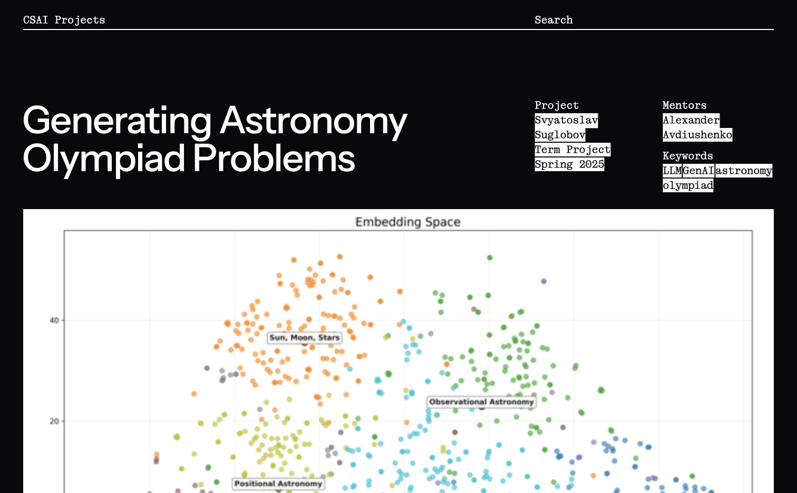

# CSAI Project Directory

This site collects the term projects and thesis projects made by CSAI students.

## ~ How to add a project ~

### Add a file

Create a file in [pages](pages). Use a short title of two or three words. 
For example, if your project is _Generating Astronomy Olympiad Problems_, 
you can name your file `astronomy-problems.md` to create a page
at `/astronomy-problems`.

You can copy an existing page to start with the right format.

### Fill in the info

The first part of the file contains the project properties (in YAML format). 
Try to spell names and tags consistently with other pages.

`picture` defines the cover picture. If possible, add cover pictures in high resolution (1424px+).
Upload pictures to [pages/public/assets](pages/public/assets).

### Write the text

The second part of the file contains the text.
Describe the project goal, then add `## Report` and write your report.

Use Markdown format. Surround LaTeX formulas with $ or $$. HTML is supported, too. 
If you want to add interactive web stuff, you can use Vue [features](https://vitepress.dev/guide/using-vue) — consult @tm-a-t.

If you add pictures to the text, use `` rather then Markdown-style pictures: 
this will make them look wider on big screens.

### Behold!

Commit to the main branch to deploy.

If you want to preview your changes first, push to a new branch or create a pull request — 
this will create a preview site.
